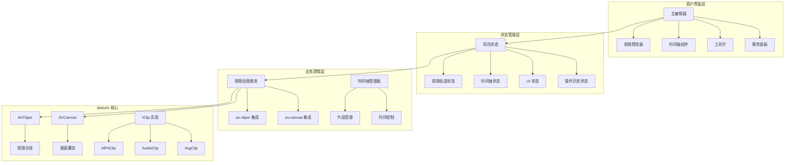
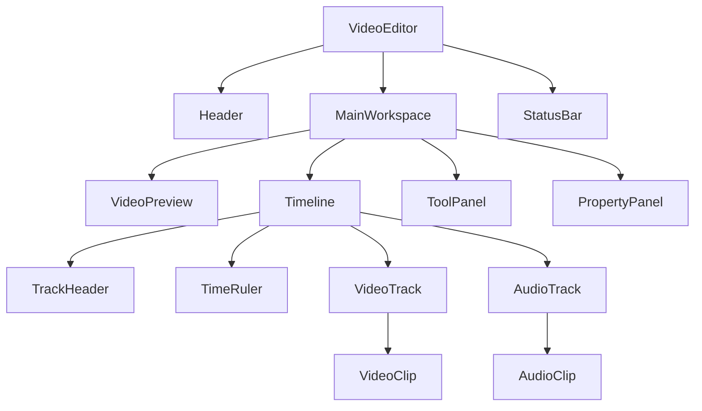
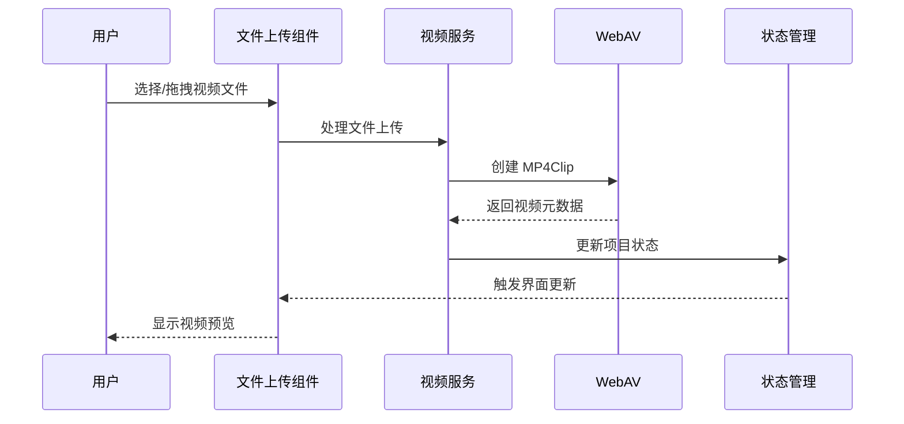
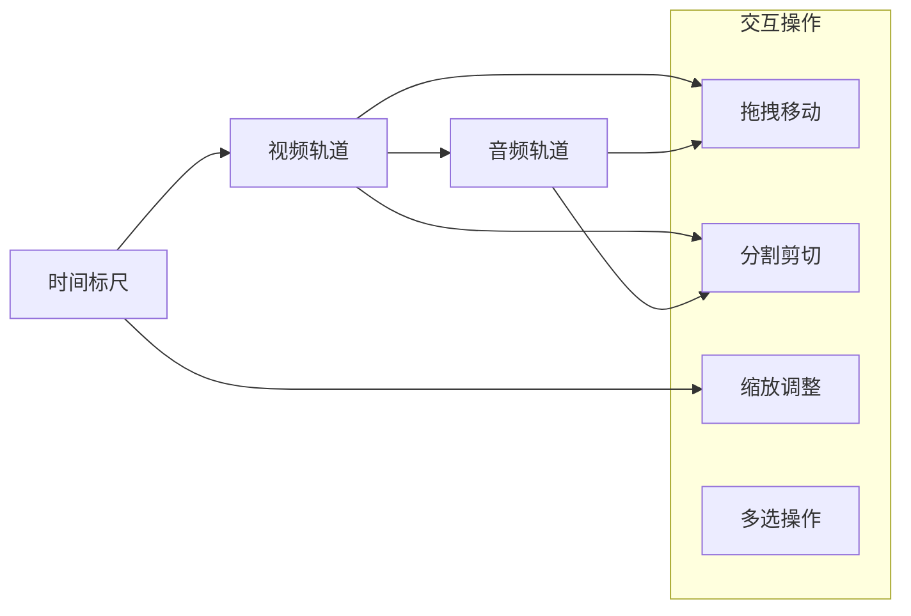
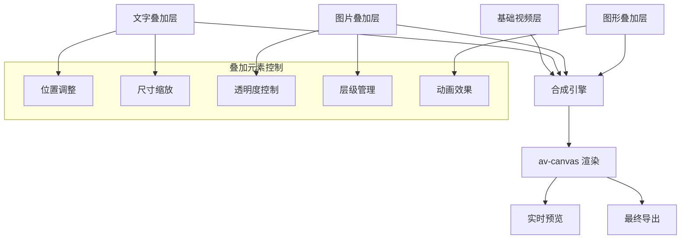

# 视频剪辑前端项目设计文档

## 1. 项目概述

本项目是一个基于 Next.js 的现代化视频剪辑工具，专注于为用户提供直观的在线视频编辑体验。通过集成 WebAV 库的强大视频处理能力，实现了从视频导入、时间轴编辑到最终导出的完整工作流程。

### 核心特性
- 实时视频预览与编辑
- 可视化时间轴操作
- 多媒体合成与叠加
- 高质量视频导出
- 现代化响应式界面

## 2. 技术栈

| 技术 | 版本 | 用途 |
|------|------|------|
| Next.js | 14+ | React 框架，提供 SSR/SSG 支持 |
| TypeScript | 5+ | 类型安全的 JavaScript |
| Shadcn/ui | Latest | 现代化 UI 组件库 |
| Zustand | 4+ | 轻量级状态管理 |
| WebAV | Latest | 视频处理核心库 |
| Tailwind CSS | 3+ | 原子化 CSS 框架 |

## 3. 系统架构



## 4. 组件架构

### 4.1 页面级组件



### 4.2 核心组件定义

#### VideoEditor (主编辑器)
```typescript
interface VideoEditorProps {
  projectId?: string;
  initialProject?: ProjectData;
}

interface VideoEditorState {
  isLoading: boolean;
  project: ProjectData;
  selectedClips: string[];
  playhead: number;
  isPlaying: boolean;
}
```

#### Timeline (时间轴组件)
```typescript
interface TimelineProps {
  duration: number;
  scale: number;
  tracks: Track[];
  onClipSelect: (clipId: string) => void;
  onClipMove: (clipId: string, newTime: number) => void;
  onClipTrim: (clipId: string, start: number, end: number) => void;
}

interface TimelineState {
  playhead: number;
  selectedClips: string[];
  scale: number;
  scrollPosition: number;
}
```

#### VideoPreview (视频预览器)
```typescript
interface VideoPreviewProps {
  width: number;
  height: number;
  currentTime: number;
  isPlaying: boolean;
  onTimeUpdate: (time: number) => void;
  onPlayToggle: () => void;
}
```

### 4.3 组件层次结构

| 组件类型 | 组件名称 | 职责 |
|----------|----------|------|
| 布局组件 | Layout, Header, Sidebar | 页面结构与导航 |
| 编辑组件 | VideoEditor, Timeline, VideoPreview | 核心编辑功能 |
| 控制组件 | PlaybackControls, ToolPanel | 用户交互控制 |
| 数据组件 | ClipRenderer, TrackRenderer | 数据展示与渲染 |
| 工具组件 | FileUploader, ExportDialog | 辅助功能 |

## 5. 状态管理架构

### 5.1 Store 结构设计

```typescript
// 项目状态 Store
interface ProjectStore {
  // 状态
  project: ProjectData | null;
  isLoading: boolean;
  error: string | null;
  
  // 操作
  loadProject: (projectId: string) => Promise<void>;
  saveProject: () => Promise<void>;
  createNewProject: () => void;
  setProject: (project: ProjectData) => void;
}

// 时间轴状态 Store
interface TimelineStore {
  // 状态
  playhead: number;
  duration: number;
  scale: number;
  isPlaying: boolean;
  selectedClips: string[];
  
  // 操作
  setPlayhead: (time: number) => void;
  play: () => void;
  pause: () => void;
  setScale: (scale: number) => void;
  selectClip: (clipId: string) => void;
  selectMultipleClips: (clipIds: string[]) => void;
}

// 编辑操作历史 Store
interface HistoryStore {
  // 状态
  history: EditAction[];
  currentIndex: number;
  canUndo: boolean;
  canRedo: boolean;
  
  // 操作
  pushAction: (action: EditAction) => void;
  undo: () => void;
  redo: () => void;
  clearHistory: () => void;
}
```

### 5.2 数据模型

```typescript
interface ProjectData {
  id: string;
  name: string;
  duration: number;
  tracks: Track[];
  settings: ProjectSettings;
  createdAt: Date;
  updatedAt: Date;
}

interface Track {
  id: string;
  type: 'video' | 'audio';
  name: string;
  clips: Clip[];
  isVisible: boolean;
  isMuted: boolean;
}

interface Clip {
  id: string;
  type: 'video' | 'audio' | 'image' | 'text';
  startTime: number;
  duration: number;
  trimStart: number;
  trimEnd: number;
  source: MediaSource;
  effects: Effect[];
  transform: Transform;
}

interface MediaSource {
  id: string;
  type: 'file' | 'camera' | 'screen';
  url: string;
  name: string;
  metadata: MediaMetadata;
}
```

## 6. WebAV 集成架构

### 6.1 av-cliper 集成

```typescript
class VideoClipService {
  private combinator: Combinator;
  
  async initializeCombinator(width: number, height: number): Promise<void> {
    this.combinator = new Combinator({
      width,
      height,
      fps: 30
    });
  }
  
  async addVideoClip(file: File, startTime: number): Promise<string> {
    const mp4Clip = new MP4Clip(await file.arrayBuffer());
    const sprite = new OffscreenSprite(mp4Clip);
    sprite.rect.x = 0;
    sprite.rect.y = 0;
    sprite.time = { offset: startTime * 1e6, duration: mp4Clip.duration };
    
    await this.combinator.addSprite(sprite);
    return sprite.id;
  }
  
  async exportVideo(): Promise<ReadableStream> {
    return this.combinator.output();
  }
}
```

### 6.2 av-canvas 集成

```typescript
class CanvasCompositionService {
  private avCanvas: AVCanvas;
  
  async initializeCanvas(containerEl: HTMLElement): Promise<void> {
    this.avCanvas = new AVCanvas(containerEl, {
      width: 1920,
      height: 1080
    });
  }
  
  async addVideoSprite(file: File): Promise<VideoSprite> {
    const videoSprite = new VideoSprite(file);
    await this.avCanvas.addSprite(videoSprite);
    return videoSprite;
  }
  
  async addTextSprite(text: string, style: TextStyle): Promise<TextSprite> {
    const textSprite = new TextSprite(text, style);
    await this.avCanvas.addSprite(textSprite);
    return textSprite;
  }
  
  getMediaStream(): MediaStream {
    return this.avCanvas.captureStream();
  }
}
```

## 7. 核心功能实现

### 7.1 视频导入与预览



**实现要点:**
- 支持多种视频格式 (MP4, WebM, MOV)
- 文件拖拽上传
- 视频元数据提取 (时长、分辨率、帧率)
- 缩略图生成
- 实时预览播放

### 7.2 时间轴编辑系统



**核心特性:**
- 可缩放时间轴 (1:1 到 1:100)
- 磁性吸附对齐
- 多轨道支持
- 实时波形显示
- 片段预览缩略图

### 7.3 剪辑操作引擎

| 操作类型 | 功能描述 | 实现方式 |
|----------|----------|----------|
| 分割 | 在指定时间点分割片段 | 创建两个新片段，调整时间范围 |
| 删除 | 移除选中片段 | 从轨道中移除，重新计算时间线 |
| 复制 | 复制片段到新位置 | 创建新片段实例，保持源引用 |
| 移动 | 拖拽调整片段位置 | 更新startTime，检测碰撞 |
| 修剪 | 调整片段入点出点 | 修改 trimStart/trimEnd 属性 |

### 7.4 画面合成与叠加



## 8. 用户界面设计

### 8.1 主界面布局

```
┌─────────────────────────────────────────────────────────┐
│                    Header (工具栏)                        │
├─────────────────────────────────────────────────────────┤
│                                                         │
│              Video Preview (视频预览区)                   │
│                                                         │
├─────────────────────────────────────────────────────────┤
│                                                         │
│               Timeline (时间轴编辑区)                     │
│                                                         │
├─────────────────────────────────────────────────────────┤
│              Status Bar (状态栏)                         │
└─────────────────────────────────────────────────────────┘
```

### 8.2 响应式设计

| 断点 | 屏幕尺寸 | 布局调整 |
|------|----------|----------|
| Mobile | < 768px | 垂直堆叠，简化工具栏 |
| Tablet | 768px - 1024px | 侧边栏收起，保持主功能 |
| Desktop | > 1024px | 完整布局，所有功能可见 |

### 8.3 关键 UI 组件

#### 时间轴组件设计
- **时间标尺**: 显示时间刻度，支持缩放
- **轨道头**: 轨道名称、静音、可见性控制
- **片段块**: 可拖拽的视频/音频片段
- **播放头**: 当前播放位置指示器
- **选择框**: 多选片段的可视化反馈

#### 视频预览器设计
- **播放控制**: 播放/暂停、进度条、音量控制
- **画质选择**: 预览质量调整 (低/中/高)
- **全屏模式**: 沉浸式预览体验
- **网格辅助**: 对齐辅助线显示

## 9. 文件系统架构

```
src/
├── app/                          # Next.js 13+ App Router
│   ├── (editor)/                 # 编辑器路由组
│   │   ├── editor/              
│   │   │   └── page.tsx         # 主编辑器页面
│   │   └── layout.tsx           # 编辑器布局
│   ├── globals.css              # 全局样式
│   └── layout.tsx               # 根布局
├── components/                   # UI 组件
│   ├── ui/                      # Shadcn/ui 基础组件
│   ├── editor/                  # 编辑器相关组件
│   │   ├── VideoEditor.tsx      # 主编辑器
│   │   ├── VideoPreview.tsx     # 视频预览器
│   │   ├── Timeline.tsx         # 时间轴
│   │   ├── TrackHeader.tsx      # 轨道头
│   │   ├── VideoClip.tsx        # 视频片段
│   │   └── PlaybackControls.tsx # 播放控制
│   ├── panels/                  # 面板组件
│   │   ├── ToolPanel.tsx        # 工具面板
│   │   ├── PropertyPanel.tsx    # 属性面板
│   │   └── EffectsPanel.tsx     # 效果面板
│   └── common/                  # 通用组件
│       ├── FileUploader.tsx     # 文件上传
│       ├── Modal.tsx            # 模态框
│       └── ProgressBar.tsx      # 进度条
├── stores/                      # 状态管理
│   ├── useProjectStore.ts       # 项目状态
│   ├── useTimelineStore.ts      # 时间轴状态
│   ├── useHistoryStore.ts       # 操作历史
│   └── useUIStore.ts            # UI 状态
├── services/                    # 业务服务
│   ├── VideoClipService.ts      # 视频剪辑服务
│   ├── CanvasService.ts         # 画布合成服务
│   ├── ExportService.ts         # 导出服务
│   └── FileService.ts           # 文件处理服务
├── hooks/                       # 自定义 Hooks
│   ├── useVideoPlayer.ts        # 视频播放器 Hook
│   ├── useTimeline.ts           # 时间轴操作 Hook
│   ├── useDragAndDrop.ts        # 拖拽功能 Hook
│   └── useKeyboardShortcuts.ts  # 键盘快捷键 Hook
├── types/                       # TypeScript 类型定义
│   ├── project.ts               # 项目相关类型
│   ├── timeline.ts              # 时间轴相关类型
│   ├── media.ts                 # 媒体相关类型
│   └── editor.ts                # 编辑器相关类型
├── utils/                       # 工具函数
│   ├── timeFormat.ts            # 时间格式化
│   ├── fileValidation.ts        # 文件验证
│   ├── videoUtils.ts            # 视频处理工具
│   └── constants.ts             # 常量定义
└── lib/                         # 第三方库配置
    ├── webav.ts                 # WebAV 配置
    └── shadcn.ts                # Shadcn/ui 配置
```

## 10. 测试策略

### 10.1 单元测试

```typescript
// 组件测试示例
describe('VideoClip Component', () => {
  it('should render clip with correct duration', () => {
    const clip = {
      id: '1',
      startTime: 0,
      duration: 5000,
      source: mockVideoSource
    };
    
    render(<VideoClip clip={clip} scale={1} />);
    expect(screen.getByTestId('clip-duration')).toHaveTextContent('5.0s');
  });
  
  it('should handle drag operations', () => {
    const onMove = jest.fn();
    render(<VideoClip clip={mockClip} onMove={onMove} />);
    
    fireEvent.dragStart(screen.getByTestId('video-clip'));
    fireEvent.dragEnd(screen.getByTestId('video-clip'));
    
    expect(onMove).toHaveBeenCalled();
  });
});

// 服务测试示例
describe('VideoClipService', () => {
  it('should process video file correctly', async () => {
    const service = new VideoClipService();
    const mockFile = new File([''], 'test.mp4', { type: 'video/mp4' });
    
    const result = await service.processVideoFile(mockFile);
    
    expect(result).toHaveProperty('duration');
    expect(result).toHaveProperty('metadata');
  });
});
```

### 10.2 集成测试

| 测试场景 | 测试内容 | 工具 |
|----------|----------|------|
| 文件上传流程 | 从选择文件到添加到时间轴 | Jest + Testing Library |
| 视频播放 | 播放控制与时间同步 | Jest + Mock WebAV |
| 剪辑操作 | 分割、移动、删除操作 | Jest + Testing Library |
| 导出功能 | 完整的导出流程测试 | Jest + Mock APIs |

### 10.3 端到端测试

```typescript
// E2E 测试示例 (Playwright)
test('complete video editing workflow', async ({ page }) => {
  await page.goto('/editor');
  
  // 上传视频文件
  await page.setInputFiles('[data-testid="file-input"]', 'test-video.mp4');
  await page.waitForSelector('[data-testid="video-clip"]');
  
  // 分割视频
  await page.click('[data-testid="timeline"]', { position: { x: 200, y: 50 } });
  await page.click('[data-testid="split-button"]');
  
  // 验证分割结果
  const clips = await page.locator('[data-testid="video-clip"]').count();
  expect(clips).toBe(2);
  
  // 导出视频
  await page.click('[data-testid="export-button"]');
  await page.waitForSelector('[data-testid="export-progress"]');
});
```