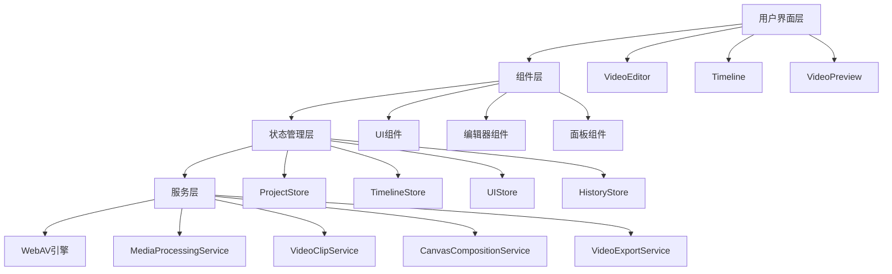

# 开发文档

## 架构概述

### 整体架构



### 数据流

1. **用户操作** → UI组件
2. **UI组件** → Action触发
3. **Action** → Store状态更新
4. **Store** → Service调用
5. **Service** → WebAV API
6. **结果** → Store更新 → UI重渲染

## 核心模块详解

### 1. 状态管理 (Stores)

#### ProjectStore
```typescript
interface ProjectStore {
  currentProject: ProjectData | null;
  projects: ProjectData[];
  
  // Actions
  createNewProject: () => void;
  loadProject: (id: string) => void;
  saveProject: () => void;
  updateProjectSettings: (settings: Partial<ProjectSettings>) => void;
}
```

#### TimelineStore
```typescript
interface TimelineStore {
  currentTime: number;
  duration: number;
  isPlaying: boolean;
  playbackRate: number;
  
  // Actions
  setCurrentTime: (time: number) => void;
  play: () => void;
  pause: () => void;
  setPlaybackRate: (rate: number) => void;
}
```

#### UIStore
```typescript
interface UIStore {
  theme: 'light' | 'dark' | 'auto';
  layout: LayoutConfig;
  activePanel: EditorPanel;
  
  // Actions
  setTheme: (theme: string) => void;
  updateLayout: (layout: Partial<LayoutConfig>) => void;
  setActivePanel: (panel: EditorPanel) => void;
}
```

### 2. 服务层 (Services)

#### MediaProcessingService
负责媒体文件的处理和管理：

```typescript
class MediaProcessingService {
  // 文件上传和处理
  async uploadFile(file: File): Promise<MediaAsset>;
  
  // 生成缩略图
  async generateThumbnail(asset: MediaAsset): Promise<string>;
  
  // 获取媒体信息
  async getMediaInfo(asset: MediaAsset): Promise<MediaInfo>;
  
  // 预处理媒体文件
  async preprocessMedia(asset: MediaAsset): Promise<void>;
}
```

#### VideoClipService
处理视频片段的操作：

```typescript
class VideoClipService {
  // 创建片段
  createClip(asset: MediaAsset, startTime: number, duration: number): Clip;
  
  // 剪切片段
  trimClip(clip: Clip, newStart: number, newDuration: number): Clip;
  
  // 分割片段
  splitClip(clip: Clip, splitTime: number): [Clip, Clip];
  
  // 应用效果
  applyEffect(clip: Clip, effect: Effect): void;
}
```

#### CanvasCompositionService
处理视频合成和渲染：

```typescript
class CanvasCompositionService {
  // 初始化画布
  initCanvas(width: number, height: number): HTMLCanvasElement;
  
  // 渲染帧
  renderFrame(time: number, tracks: Track[]): ImageData;
  
  // 合成视频
  async composeVideo(project: ProjectData): Promise<Blob>;
  
  // 实时预览
  startPreview(canvas: HTMLCanvasElement): void;
}
```

### 3. 组件架构

#### 主编辑器组件
```typescript
// VideoEditor - 主容器组件
├── Header - 头部工具栏
├── MainWorkspace
│   ├── LeftPanel - 媒体库面板
│   ├── CenterArea
│   │   ├── VideoPreview - 视频预览区
│   │   └── Timeline - 时间轴区域
│   └── RightPanel - 属性面板
└── Footer - 状态栏
```

#### 时间轴组件
```typescript
// Timeline - 时间轴主组件
├── TimelineToolbar - 工具栏
├── TimeRuler - 时间标尺
├── PlayheadIndicator - 播放头
├── TrackHeader - 轨道头部
└── TrackContent - 轨道内容
    └── ClipItem[] - 片段项
```

## API 参考

### Store APIs

#### useProjectStore

```typescript
const {
  currentProject,
  createNewProject,
  loadProject,
  saveProject,
  addTrack,
  removeTrack,
  addClip,
  removeClip,
  updateClip
} = useProjectStore();
```

#### useTimelineStore

```typescript
const {
  currentTime,
  duration,
  isPlaying,
  play,
  pause,
  setCurrentTime,
  setDuration
} = useTimelineStore();
```

### Service APIs

#### 媒体处理

```typescript
import { mediaProcessingService } from '@/services';

// 上传文件
const asset = await mediaProcessingService.uploadFile(file);

// 生成缩略图
const thumbnail = await mediaProcessingService.generateThumbnail(asset);

// 获取媒体信息
const info = await mediaProcessingService.getMediaInfo(asset);
```

#### 视频剪辑

```typescript
import { videoClipService } from '@/services';

// 创建片段
const clip = videoClipService.createClip(asset, 0, 10);

// 剪切片段
const trimmedClip = videoClipService.trimClip(clip, 2, 5);

// 分割片段
const [clip1, clip2] = videoClipService.splitClip(clip, 5);
```

## 开发工作流

### 1. 添加新功能

1. **定义类型** - 在 `src/types/` 中添加相关类型定义
2. **实现服务** - 在 `src/services/` 中添加业务逻辑
3. **更新Store** - 如需要，更新相应的状态管理
4. **创建组件** - 在 `src/components/` 中创建UI组件
5. **集成测试** - 编写和运行测试用例

### 2. 调试指南

#### 启用调试日志
```javascript
// 在浏览器控制台中
localStorage.setItem('debug', 'video-editor:*');
```

#### 性能监控
```typescript
import { performanceMonitor } from '@/utils/performance-monitor';

// 监控函数执行时间
const endTiming = performanceMonitor.startTiming('operationName');
// ... 执行操作
endTiming();

// 监控自定义指标
performanceMonitor.measureCustomMetric('clipCount', clips.length);
```

#### 状态调试
```typescript
// 在开发环境中访问store状态
window.__STORES__ = {
  project: useProjectStore.getState(),
  timeline: useTimelineStore.getState(),
  ui: useUIStore.getState()
};
```

### 3. 测试策略

#### 单元测试
- 使用 Jest 和 React Testing Library
- 测试组件渲染和交互
- 测试Store状态变化
- 测试工具函数

#### 集成测试
- 测试组件间的交互
- 测试数据流
- 测试用户工作流

#### E2E测试
- 使用 Playwright 或 Cypress
- 测试完整的用户场景
- 测试导出功能

## 性能优化

### 1. 渲染优化

```typescript
// 使用 React.memo 优化组件
const ClipItem = React.memo(({ clip }) => {
  // 组件实现
});

// 使用 useMemo 缓存计算结果
const thumbnails = useMemo(() => {
  return generateThumbnails(clips);
}, [clips]);

// 使用 useCallback 缓存函数
const handleClipClick = useCallback((clipId: string) => {
  selectClip(clipId);
}, [selectClip]);
```

### 2. 时间轴虚拟化

```typescript
// 只渲染可见的片段
const visibleClips = useMemo(() => {
  const startTime = viewport.startTime;
  const endTime = viewport.endTime;
  
  return clips.filter(clip => 
    clip.startTime < endTime && 
    clip.startTime + clip.duration > startTime
  );
}, [clips, viewport]);
```

### 3. Web Worker 使用

```typescript
// 在Web Worker中处理重计算任务
const worker = new Worker('/workers/video-processing.worker.js');

worker.postMessage({
  type: 'PROCESS_VIDEO',
  data: { clips, effects }
});

worker.onmessage = (event) => {
  const { type, result } = event.data;
  if (type === 'PROCESS_COMPLETE') {
    updatePreview(result);
  }
};
```

## 部署指南

### 1. 构建优化

```bash
# 生产构建
npm run build

# 分析包大小
npm run analyze
```

### 2. 环境配置

```bash
# 生产环境变量
NEXT_PUBLIC_APP_ENV=production
NEXT_PUBLIC_CDN_URL=https://cdn.example.com
NEXT_PUBLIC_API_URL=https://api.example.com
```

### 3. 服务器配置

```nginx
# Nginx 配置示例
server {
  listen 80;
  server_name your-domain.com;
  
  location / {
    proxy_pass http://localhost:3000;
    proxy_set_header Host $host;
    proxy_set_header X-Real-IP $remote_addr;
  }
  
  # 静态资源缓存
  location /_next/static/ {
    expires 1y;
    add_header Cache-Control "public, immutable";
  }
}
```

## 常见问题

### Q: 如何添加新的视频格式支持？
A: 在 `mediaProcessingService` 中添加新格式的处理逻辑，更新 `SUPPORTED_FORMATS` 常量。

### Q: 如何自定义快捷键？
A: 修改 `editorConfig` 中的 `shortcuts` 配置，或通过UI设置面板动态修改。

### Q: 如何添加新的视频效果？
A: 在 `effects/` 目录下创建新的效果类，实现 `Effect` 接口，并在效果面板中注册。

### Q: 如何优化大文件处理性能？
A: 使用分片上传、懒加载、Web Worker处理、缓存策略等技术。

## 贡献指南

请参考主 README.md 中的贡献指南部分。

## 更新日志

### v0.1.0 (当前版本)
- 初始版本发布
- 基础视频编辑功能
- 多轨道支持
- 导出功能